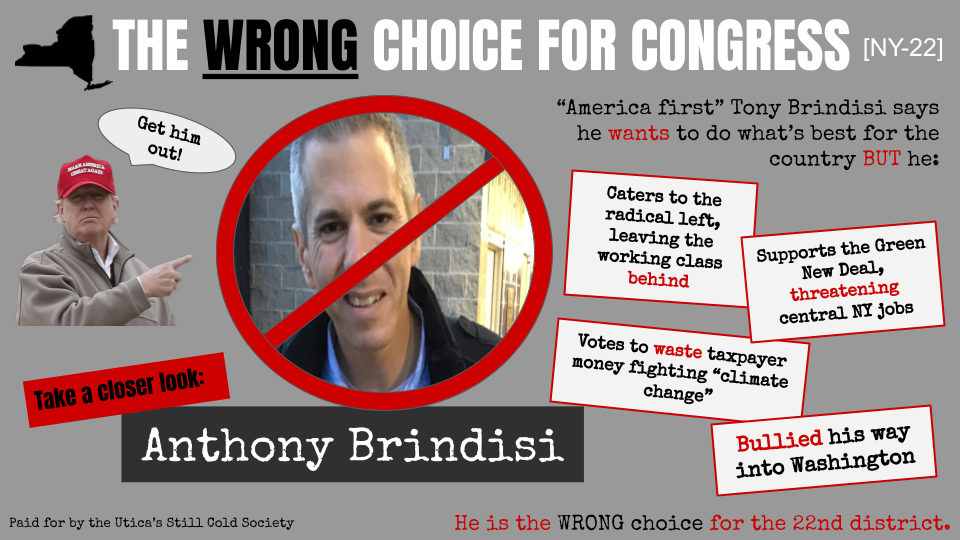

```{r setup, include=FALSE}
knitr::opts_chunk$set(echo = TRUE, message = FALSE, warning = FALSE)
library(tidyverse) 
library(readxl) 
library(tidyverse) 
library(janitor) 
library(ggplot2) 
library(stringr) 
library(here)
library(kableExtra)
```

## An overview
Public campaigns are an essential tool to communicate and frame proposals to key audiences. In this report, we design a public campaign opposing the Green New Deal, aimed towards New York's 22nd Congressional District, with the purpose of unseating incumbent Representative Anthony Brindisi. To do so, we look at a number of key variables of congressional districts related to global warming as well as the votes from previous elections. Then, we create a graph to look at the relationship between two of the global warming variables and identify in which the relationship is strongest, in order to select which elected audience may be easily swayed and thus which congressperson could potentially be unseated.


```{r}
# Reading in the data for the 116th Congress
data <- read.csv(here("data","congress_116_data.csv"))
metadata <- read.csv(here("data","Combined_Metadata.csv"))

# Reordering metadata 'variable' to match variable order in 'data':
order <- match(names(data),metadata$variable)
metadata <- metadata[order,]
```

## Selecting a congressional district
To begin, we filter a dataset from the 116th Congress to select for Democrats who won their election in 2018 by less than 51% and have a high LCV score. From these congresspeople, we select for a few different variables related to global warming to look at the percentage of constituents who believe:

- Global warming is occuring
- Global warming is caused by natural influence, not by human influence
- Congress should not act or should act less on global warming

We create a table to get an overview of what these congressional districts look like.

```{r}
# Filtering for democrats who barely won their seat in the general, have a high lcv score and have high opposition of key GW variables

low_dems <- data %>% 
  filter(party == "D" & general_percent < 0.51 & lcv_score>90) %>% 
  select("district_id", "candidate_name", "general_percent", "lcv_score", 
         "happeningOppose", 
         "humanOppose", 
         "congressOppose")

low_dems$general_percent <- round(low_dems$general_percent, digit = 2)


# Creating a table
low_dems %>% 
  kable(col.names = c("District ID", "Candidate Name", "Proportion of Votes Won", "LCV Score", 
                      "GW Happening Oppose", "GW Human-caused Oppose", "Congress Oppose"),
        caption = "Table 1. Constituents' beliefs on global warming for congressional districts with Democratic candidates who won their election by less than 51%." ) %>% 
  kable_styling(full_width = FALSE,
                bootstrap_options = "striped")

```


```{r}
# Creating a plot to show the relationship between human caused opposition and congress opposition
ggplot(data = low_dems, aes(x= humanOppose, 
                       y= congressOppose)) + 
  geom_point() +
  geom_text(aes(label=district_id),
            vjust=2, hjust=1) +
  theme_minimal() + 
  labs(y = "Opposed to Congress acting on GW (percentage)",
       x = "Believed GW is not caused by human influence (percentage)",
       title = "Relationship between constituents' beliefs on global warming (GW)\nvariables, by congressional districts")
```

**Figure 1.** Opinions on global warming (GW) within congressional districts with Democratic representatives who won their seat in the previous election by less than 51%. Points which are further right and towards the top of the plot indicate districts that both believed global warming is largely not caused by human influence and that congress should not act strongly on global warming.

Based on the results of the table and figure, NY-22 appears to be a district that has an audience that likely would be opposed to the Green New Deal, and thus may be easily swayed towards opposing a candidate who supports the Green New Deal. Thus, we move forward with NY-22 and target their congressperson, Anthony Brindisi, who has a high LCV score and may support the Green New Deal. 

## Analyzing New York's 22nd Congressional District

New York’s 22nd Congressional District has an estimated total population of 688,391. Demographically, 89% of the total population is white. The median age is 41 years, with 80% of the population being over 18 years old. The district has 129,863 active Democratic voters and 158,376 active Republican voters. The district voted for the Republican candidate in the previous two presidential elections after having voted Democratic from 2000-2008. In the 2018 election, Anthony Brindisi won by 50.9% (127,715 votes) to Claudia Tenney (R)'s 49.1% (123,242 votes). The race was considered a battleground race and key to determining the U.S. House partisan control. 

Along with the constituents’ opposition to Congress addressing climate change and the lack of belief of human-caused global warming, a portion of the population also believes that global warming is not happening at all (14.2%). These factors, combined with a Republican majority of enrolled voters throughout the district, makes NY-22 a prime location for a targeted campaign to replace a conservationist Democrat with a congressperson who avidly opposes the Green New Deal.

We identified democrat Anthony J. Brindisi who is conservation-minded and more liberal when it comes to climate policy (LCV = 97), as a potential target. 
Congressman Brindisi is at risk of losing reelection in New York District 22 due to a slim margin of victory in 2018 and his district constituents' opposition to the idea of human-induced climate change (humanOppose = 37.7%) and their beliefs that Congress should not be pushing forward policies that address climate change (congressOppose = 20.3%). 

## Creating a public campaign
Because NY-22 has an older population, we selected a newspaper advertisement as a potential route for a public campaign. A mockup of the advertisement is included below, attacking Congressman Brindisi with the hope of unseating him in the district. 




