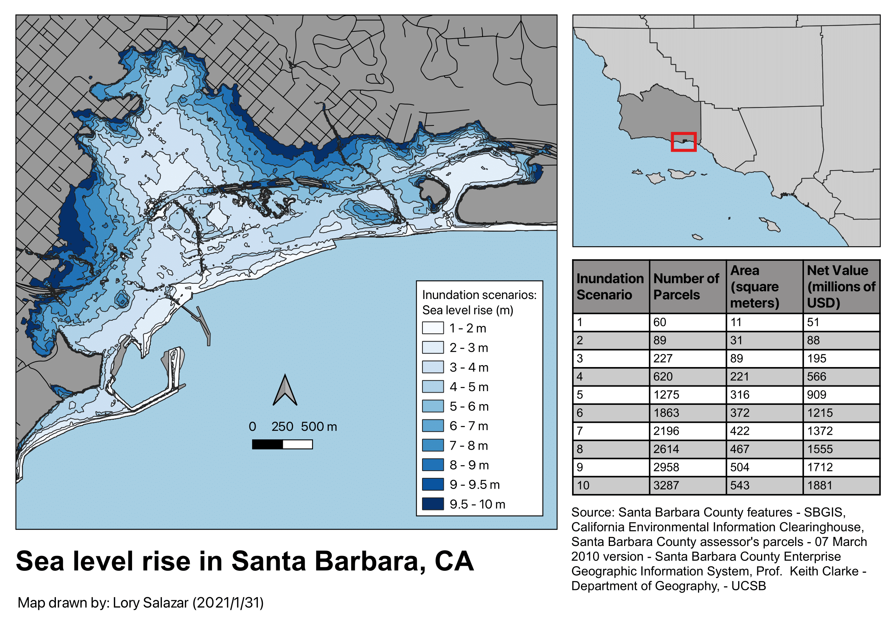

```{r setup, include=FALSE}
knitr::opts_chunk$set(echo = FALSE)
library(tidyverse)
library(here)
library(kableExtra)
```

## Estimating scenarios for sea-level rise in Santa Barbara County
In this report, we analyze the potential impacts of extreme sea level rise in Santa Barbara County, CA. We estimate the impact of ten different scenarios of sea level rise, from 1 m to 10 m increases in mean sea level. The results of the analysis reveal the size of the area flooded, count of parcels, and millions of flooded property losses.

We present our results in a map and table.

### Methods
We used geospatial data representing the inundation scenarios, net assessed value (USD) for parcels, and a basemap of California. We merged the inundation scenarios into a single layer, then joined the layer with the parcels data. To find the flooded area, we used the `$area` function in the QGIS field calculator. Additionally, we converted the net assessed values to units of millions of USD.

Our initial results are presented in the table below.

```{r}
sea_level_rise <- read.csv(here("data","sea_level_rise.csv")) 

sea_level_rise %>% 
  kable(col.names = c("Inundation scenario","Number of Parcels","Area (sq m)","Net Value (millions of USD)")) %>% 
  kable_styling(full_width = FALSE)
```

## Results and analysis
We presented our results in the map below.



The map indicates the different inundation scenarios in Santa Barbara County, with dark blue indicating the worst scenario of 9.5 m to 10 m of sea level rise. Each scenario is expected to flood differing numbers of land parcels, covering a given area and accounting for millions of USD in property losses. 
The number of parcels, total area, and net value that are impacted by the flooding from sea level rise per scenario is indicated in the table. 


